# Post-Processing Pass

一句话直觉：**post-processing pass 不是在画世界里的物体，而是在处理一张已经画好的 texture**。

例如 bloom 流程里，场景先画到 HDR texture，然后后面的 pass 一张 texture 读进来，处理后写到另一张 texture。

下面是这套 pass 的数据流图：

```mermaid
graph LR
    HDRPass["HDR Pass<br/>Draw scene geometry"] --> HDRTex["m_hdrRenderTexture<br/>Full HDR scene color"]
    HDRTex --> BrightPass["Bright Pass<br/>DrawFullQuad"]
    BrightPass --> BrightTex["m_brightPassTexture<br/>Bright pixels only"]
    BrightTex --> HBlur["Horizontal Blur Pass<br/>DrawFullQuad"]
    HBlur --> HBlurTex["m_horizontalBlurTexture<br/>Horizontal blur result"]
    HBlurTex --> VBlur["Vertical Blur Pass<br/>DrawFullQuad"]
    VBlur --> VBlurTex["m_verticalBlurTexture<br/>Final blurred bloom"]
    HDRTex --> ToneMap["Tone Mapping Pass<br/>DrawFullQuad"]
    VBlurTex --> ToneMap
    ToneMap --> Backbuffer["m_renderTargetView<br/>Backbuffer / screen"]
```



---

## Bloom 的基本数据流

```text
HDR Pass
= render scene into HDR texture / 把 3D 场景画进 HDR texture

Bright Pass
= extract bright pixels / 从 HDR texture 里提取亮的像素

Horizontal Blur Pass
= blur bright texture horizontally / 对亮部 texture 做横向模糊

Vertical Blur Pass
= blur horizontally blurred texture vertically / 对横向模糊结果做纵向模糊

Tone Mapping Pass
= combine HDR scene + blurred bloom, then output to screen / 把原 HDR 场景和 bloom 合并，再输出到屏幕
```

对应 texture：

```text
m_hdrRenderTexture        = full HDR scene color / 完整 HDR 场景颜色
m_brightPassTexture       = bright pixels only / 只保留亮部
m_horizontalBlurTexture   = horizontally blurred bright pixels / 横向模糊后的亮部
m_verticalBlurTexture     = final blurred bloom texture / 最终 bloom 光晕
m_renderTargetView        = backbuffer / 最终显示到屏幕的输出
```

---

## `DrawFullQuad()` 是什么

`DrawFullQuad()` 的目的：**画一个覆盖整个 render target 的 quad，让当前 pixel shader 对每个输出像素执行一次**。

```text
DrawFullQuad
= draw a full-screen quad / 画一个覆盖输出目标的全屏 quad
= trigger current pixel shader for every output pixel / 让当前 pixel shader 跑完整张输出 texture
```

它不是为了画一个世界里的方块。它是 post-process 的执行方式。

例如 Bright Pass：

```cpp
BeginBrightPass();
DrawFullQuad();
EndBrightPass();
```

可以理解成：

```text
for every pixel in m_brightPassTexture:
    read m_hdrRenderTexture at the same UV
    keep the color if it is bright
    otherwise output black
```

D3D11 不是真的用 CPU `for` loop 做，而是：

```text
full quad covers render target / full quad 覆盖输出 texture
rasterizer generates pixel shader work / rasterizer 生成 pixel shader 执行
pixel shader samples input texture and writes output / pixel shader 采样输入 texture 并写输出
```

---

## 什么时候需要 Full Quad

判断标准：

```text
Am I processing an existing texture pixel-by-pixel?
= yes -> use DrawFullQuad / 是，就用 DrawFullQuad

Am I drawing real geometry in the world?
= yes -> draw mesh / 是，就画 mesh，不用 DrawFullQuad
```

需要 `DrawFullQuad()` 的场景：

```text
Bright Pass / 亮部提取
Blur Pass / 模糊
Tone Mapping / HDR 转屏幕颜色
Color Grading / 调色
FXAA / 屏幕空间抗锯齿
Copy or composite texture / 拷贝或合成 texture
```

不需要 `DrawFullQuad()` 的场景：

```text
Main scene pass / 正常画场景
Shadow pass / 从 light 视角画 depth
Mesh rendering / 画模型
Skybox cubemap pass / 画 cube 采样 cubemap
Debug world rendering / 画 debug 线和形状
Material::Render / 画材质物体
```

---

## 为什么 Blur 分横向和纵向

真正的 2D blur 如果直接对每个像素采样周围一大片区域，会比较贵。

常见优化是 separable blur / 可分离模糊：

```text
2D blur
~= horizontal blur + vertical blur / 横向模糊 + 纵向模糊
```

所以 bloom 通常分两步：

```text
Bright texture -> Horizontal blur texture -> Vertical blur texture
```

最后 tone mapping 里：

```text
final color = toneMap(HDR scene + blurred bloom)
```

---

## Pass Begin / End 的作用

`Begin*Pass()` 通常负责设置这个 pass 需要的 GPU state：

```text
Set RTV / 设置输出 render target
Clear RTV / 清空输出 texture
Bind shader / 绑定当前 pass 的 shader
Bind input SRV / 绑定要读取的 texture
Set sampler / 设置采样方式
Set depth mode / 设置 depth 状态
```

`End*Pass()` 通常负责清理绑定：

```text
Unbind SRV / 解除 shader input texture
Unbind RTV / 解除 output render target
Avoid read-write conflict / 避免下一 pass 读写同一 resource 冲突
```

重要点：

```text
End*Pass does not save the result / End*Pass 不是保存数据
Draw calls already wrote the result into the bound render target / draw 的时候数据已经写进当前 RTV 对应的 texture
```

---

## 相关链接

- [[rendering/Render-Target]]
- [[03 - D3D11/D3D11.Texture]]
- [[rendering/Shadow-Map]]
