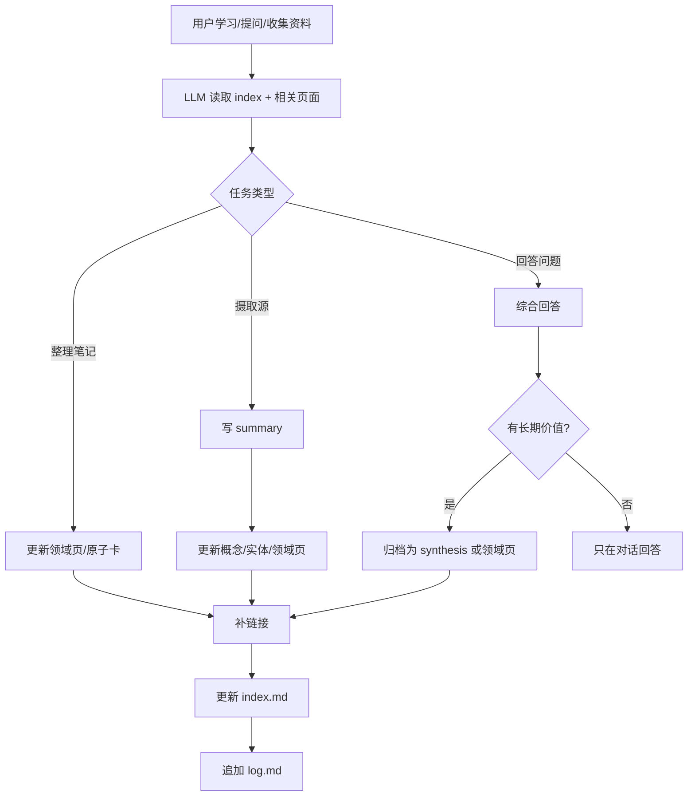

# Zion 知识迭代系统

> 目标：把这个 Vault 从“笔记集合”升级为“持续编译的技术知识库”。LLM 负责维护结构与链接，用户负责学习方向、材料选择和判断。

---

## 1. 当前库的形态判断

Zion 已经不是空白知识库，而是一个以 **Game Dev / Graphics / Engine Programming** 为核心的技术库：

- [[02 - UnrealEngine]]：最大知识区，包含 UE Framework、GAS、AI、Animation、Rendering、Multiplayer 等。
- [[01 - C++]]：大量 C++ 原子卡片，适合作为 API / 语言机制速查层。
- [[03 - D3D11]]、[[rendering/Render-Target]]、[[rendering/Deferred-Rendering]]、[[rendering/Portal-Rendering]]：图形管线与渲染实践层。
- [[animation/Skinning]]、[[04 - Math]]：动画与图形数学支撑层。
- [[wiki/summaries/_TEMPLATE]]、[[wiki/syntheses/_TEMPLATE]]：已经具备 raw → wiki 的源摄取框架。

因此，这个系统不应只做“论文摘要库”，而应服务于：

1. 技术概念理解；
2. API / 引擎机制速查；
3. 渲染与 UE 实现路线；
4. 阅读材料和对话答案的长期沉淀。

---

## 2. 定制后的四类知识单元

### 2.1 Source Summary：源摘要

位置：`wiki/summaries/`

保存某篇文章、论文、视频、文档的客观摘要。一源一页，强调来源、关键结论、可迁移知识。

### 2.2 Atomic Note：原子技术卡

位置：已有领域目录优先，例如 `01 - C++/`、`02 - UnrealEngine/<subdomain>/`、`03 - D3D11/`、`04 - Math/`。

解释一个函数、类、API、数学概念或术语。短、可链接、适合作为综合页的积木。

### 2.3 Domain Synthesis：领域综合页

位置：`rendering/`、`animation/`、`llm/` 或 `wiki/syntheses/`。

把多个原子卡和来源编译成“可执行理解”。例如 Deferred Rendering 的 pass chain、UE GAS 的心智模型、D3D11 Constant Buffer 与 HLSL register 的关系。

### 2.4 Entity Page：实体页

位置：`wiki/entities/`

人、组织、项目、库、论文、产品。例如 Epic Games、Unreal Engine、Direct3D、glTF、Vaswani et al.。

---

## 3. 核心循环

---

## 4. 推荐的日常用法

### 4.1 学一个新 API

用户可以说：“把 UGameplayAbilitySpec 整理成我的知识库格式。”

LLM 应当找现有 UE/GAS 相关页，更新或创建对应原子卡，补充签名、作用、生命周期、最小示例、常见坑，并链接到相关 GAS 页面。

### 4.2 读一篇文章 / 论文

用户把材料放进 `raw/` 后说：“摄取 raw/papers/xxx.pdf。”

LLM 应当写 `wiki/summaries/xxx.md`，提取会影响已有 UE / rendering / D3D11 / math 页面的内容，更新相关领域页，并标出新源和旧笔记的矛盾或补充关系。

### 4.3 聊出一个清晰答案后归档

用户可以说：“把刚才这段解释归档。”

LLM 应判断归档位置：具体 UE 子系统 → `02 - UnrealEngine/<subdomain>/`；渲染主题 → `rendering/`；跨领域分析 → `wiki/syntheses/`。

---

## 5. 优先改进路线

### Phase 1：让控制层适配所有 Agent

已完成：新增 [[AGENTS]]，让 Codex / Claudian / 其他 Agent 都能遵循同一套维护规则。

### Phase 2：让 index 真正覆盖现有大库

当前 [[index]] 只登记了少量代表页，但实际 Vault 中已有大量 UE / C++ / D3D11 原子卡。下一步建议：

- 为 `02 - UnrealEngine/` 生成分区索引；
- 为 `01 - C++/` 生成主题索引；
- 为 `03 - D3D11/` 生成 pipeline 索引；
- 不必一次登记所有页面，可先登记 hub 页和高价值页。

### Phase 3：建立每个领域的 Hub 页

建议逐步创建或完善：

- `02 - UnrealEngine/UE-Hub.md`
- `03 - D3D11/D3D11-Hub.md`
- `01 - C++/CPP-Hub.md`
- `04 - Math/Math-Hub.md`
- `rendering/Rendering-Hub.md`

Hub 页负责：学习路线、核心概念图、常用链接、缺口清单。

### Phase 4：周期性 lint

每周或每个学习阶段结束后，让 LLM 检查：最近新增页是否入索引、是否有死链、是否有同义重复页、哪些长页应拆成原子卡、哪些原子卡应汇总为 synthesis。

---

## 6. 最小可执行命令集

- “读取 [[AGENTS]]，以后按这个系统维护。”
- “摄取 `raw/articles/...`。”
- “把这个回答归档到知识库。”
- “更新相关页并补链接。”
- “检查最近 10 个修改是否需要更新 [[index]]。”
- “lint wiki，但先只给报告，不要修改。”
- “为 UE/GAS 生成一个 Hub 页计划。”

---

## 7. 关键原则

1. **不是 RAG，而是编译**：资料读过后要变成持久页面。
2. **不是只写摘要，而是更新网络**：每次摄取都应影响相关概念页。
3. **不是追求文件多，而是链接密度高**：孤立页面价值低。
4. **不是覆盖用户笔记，而是增量维护**：旧内容优先保留，必要时追加修订块。
5. **不是一次性重构，而是小步迭代**：每次操作都能被 git 追踪、回滚、审阅。
